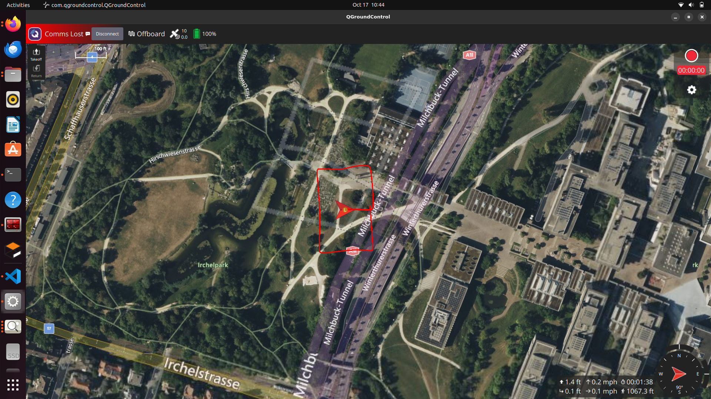
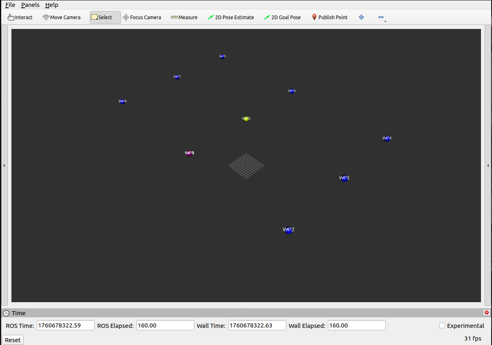
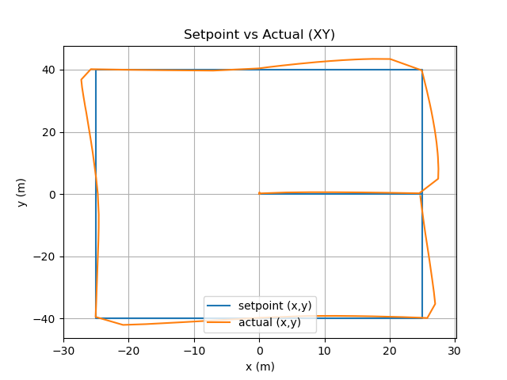

# PX4_Offboard_Simulation
---
## 🧑‍💻 Author
**T.Jaswanth Reddy**   
<a href="mailto:jaswant@email.com" target="_blank">
    
</a>
[Gmail](reddyjaswanth525@gmail.com) 
  <a href="https://linkedin.com/in/jaswant" target="_blank">
    
  </a>
[LinkedIn](https://www.linkedin.com/in/thugu-jaswanth-reddy-12a72828b/) 
  <a href="https://github.com/jaswant" target="_blank">
    
  </a>
[GitHub](https://github.com/JaswanthReddyT)

---
## 🛰️ Overview
This project demonstrates **autonomous waypoint navigation** in offboard mode** using a PX4-based drone simulation (Iris model) in **Gazebo Classic**.  
An offboard ROS 2 node (`offboard_waypoints.py`) sends position setpoints (waypoints) to the **Pixhawk flight controller (PX4 SITL)** through **MAVROS**, guiding the drone through **9 waypoints (W0–W8)** and finally returning to launch after mission completion.

---

## 🧠 Project Objective

- Simulate a drone flying in **offboard mode** using **ROS 2**, **PX4**, and **Gazebo Classic**.  
- Send **9 waypoints (W0–W8)** from an offboard computer to PX4 via MAVROS.  
- Execute a full mission flow:
  1. **W0** – Arm and take off vertically.  
  2. **W1–W8** – Navigate through all waypoints sequentially.  
  3. **Return to Launch (RTL)** – Automatically land after W8.

---

## ⚙️ System Requirements

| Component | Version / Notes |
|------------|----------------|
| **ROS 2** | Humble |
| **PX4 Autopilot** | v1.15 (SITL mode) |
| **Gazebo Classic** | Included with PX4 (Iris model) |
| **MAVROS** | Installed and configured for PX4 |
| **QGroundControl ** | For real-time monitoring |
| **Python 3** | Required for `rclpy`, `mavros`, and `matplotlib` |

---

## 🧰 Install Required Dependencies

- If not already installed:
```bash
sudo apt update
sudo apt install ros-${ROS_DISTRO}-mavros ros-${ROS_DISTRO}-mavros-extras ros-${ROS_DISTRO}-gazebo-ros-pkgs
sudo apt install python3-colcon-common-extensions python3-matplotlib
```
## 📦  Create a new ROS 2 Python package
- If you don’t already have a workspace, create one first:

```bash

# Create workspace
mkdir -p ~/ros2_ws/src
cd ~/ros2_ws/src
```
- Create Package
```bash

ros2 pkg create --build-type ament_python offboard_control --dependencies rclpy mavros_msgs geometry_msgs sensor_msgs visualization_msgs std_msgs
```
## 🧭 Clone the Repository into the Package
- Now clone this GitHub repository into your src directory:
```bash
cd ~/ros2_ws/src/offboard_control/
git clone https://github.com/JaswanthReddyT/PX4_Offboard_Simulation.git --recursive
```
 **Note:** Move the offboard.py file into the offboard_control/ folder inside the package and ensure it’s executable:

```bash

mv <repo-name>/offboard_waypoints.py ./offboard_control/
chmod +x ./offboard_control/offboard_waypoints.py
```
## 🧱 Build the Package
- From the root of your workspace:

```bash

cd ~/ros2_ws
colcon build
#After building, source your workspace
source install/setup.bash
```
---

## 🚀 Step-by-Step Guide to Perform the Task

### **🧭 Step 1:** Launch the Drone in Gazebo (PX4 SITL)
- In a new terminal:

```bash

cd ~/PX4-Autopilot
make px4_sitl gazebo
```
✅ This launches PX4 SITL and opens Gazebo Classic with the Iris quadcopter model.
You should see the drone appear in the simulation world.


### ⚡ Step 2: Launch the MAVROS Node
- In another terminal:

```bash

source /opt/ros/${ROS_DISTRO}/setup.bash
ros2 run mavros mavros_node --ros-args -p fcu_url:=udp://:14540@
```
You should see output similar to:

```css
[ INFO] [mavros]: MAVROS started. Connected to PX4.
#This confirms the MAVROS bridge is connected to PX4.
```
### 🧠 Step 3:Run the Offboard Node

- In a third terminal:

```bash

source ~/ros2_ws/install/setup.bash
ros2 run offboard_control offboard_waypoints
```
- if running directly:

```bash

cd ~/ros2_ws/src/offboard_control/offboard_control/
python3 offboard_waypoints.py
```
- **The node will:** Arm the drone (W0)
**->**
  Take off vertically
**->**
  Fly through W1–W8
**->**
  Return to launch (RTL) and land automatically

### 🛰️ Step 4: Monitor Using QGroundControl
```css
Launch QGroundControl you can the drone tavelling through the given waypoints in the map.
```

---
## 🗺️Waypoints Published
Below is an image of the Waypoints that are given to FCU :


## Path of the Drone
Below is an image that shows the predected setpoints path and the actual travelled path of the drone :


